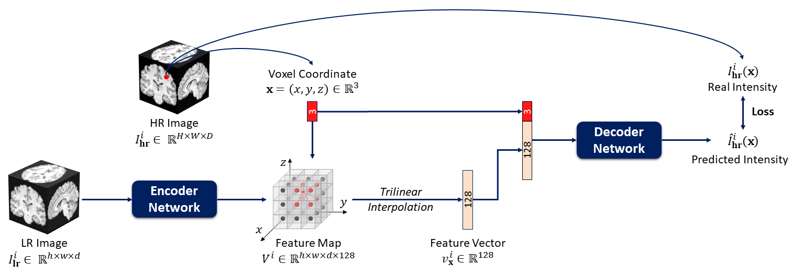
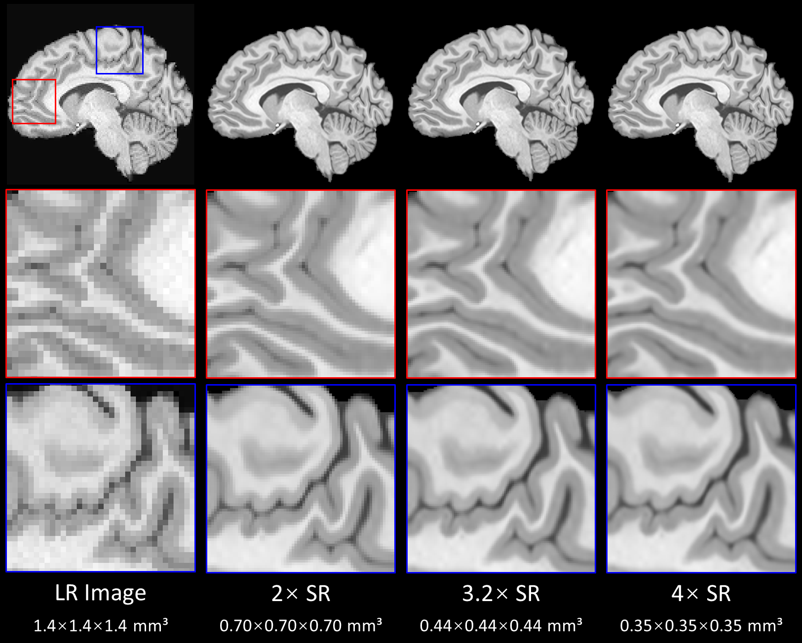

# ArSSR

This repository is the pytorch implementation of our manuscript "An Arbitrary Scale Super-Resolution Approach for 3-Dimensional Magnetic Resonance Image using Implicit Neural Representation" [[ArXiv]](https://arxiv.org/abs/2110.14476).



*Figure 1: Oveview of the ArSSR model.*

## Abstract

High Resolution (HR) medical images provide rich anatomical structure details to facilitate early and accurate diagnosis. In magnetic resonance imaging (MRI), restricted by hardware capacity, scan time, and patient cooperation ability, isotropic 3-dimensional (3D) HR image acquisition typically requests long scan time and, results in small spatial coverage and low signal-to-noise ratio (SNR). Recent studies showed that, with deep convolutional neural networks, isotropic HR MR images could be recovered from low-resolution (LR) input via single image super-resolution (SISR) algorithms. However, most existing SISR methods tend to approach a scale-specific projection between LR and HR images, thus these methods can only deal with a fixed up-sampling rate. For achieving different up-sampling rates, multiple SR networks have to be built up respectively, which is very time-consuming and resource-intensive. In this paper, we propose ArSSR, an **Ar**bitrary **S**cale **S**uper-**R**esolution approach for recovering 3D HR MR images. In the ArSSR model, the reconstruction of HR images with different up-scaling rates is defined as learning a continuous implicit voxel function from the observed LR images. Then the SR task is converted to represent the implicit voxel function via deep neural networks from a set of paired HR and LR training examples. The ArSSR model consists of an encoder network and a decoder network. Specifically, the convolutional encoder network is to extract feature maps from the LR input images and the fully-connected decoder network is to approximate the implicit voxel function. Due to the continuity of the learned function, a *single* ArSSR model can achieve arbitrary up-sampling rate reconstruction of HR images from any input LR image after training. Experimental results on three datasets show that the ArSSR model can achieve state-of-the-art SR performance for 3D HR MR image reconstruction while using a single trained model to achieve arbitrary up-sampling scales. **All the NIFTI data about Figure 2 can be downloaded in [LR image](https://drive.google.com/file/d/1C_mMB4Lpu530zmgBE343MxULBKNzKsev/view?usp=sharing), [2x SR result](https://drive.google.com/file/d/1H_rbVgvdxtTTEcuYF4hPxZ93I4UUT6J2/view?usp=sharing), [3.2x SR result](https://drive.google.com/file/d/1BCj-YdPz6ta5-UONqc8Yl_4i3sYa6mZY/view?usp=sharing), [4x SR result](https://drive.google.com/file/d/1Mnzp4DK-GHJxF962VJa7iOHT5adlBdET/view?usp=sharing).** 



Figure 2: An example of the SISR tasks of three different  isotropic up-sampling scales *k={2, 3.2, 4}* for a 3D brain MR image by the ***single*** ArSSR model.

---

## 1.  Running Environment

- python 3.7.9
- pytorch-gpu 1.8.1
- tensorboard 2.6.0
- SimpleITK,  tqdm, numpy, scipy, skimage

## 2.  Pre-trained Models

In the *pre_trained_models* folder, we provide the three pre-trained ArSSR models (with three difference encoder networks) on HCP-1200 dataset. You can improve the resolution of your images thourgh the following commands:

```shell
python test.py -input_path [input_path] \
               -output_path [output_path] \
               -encoder_name [RDN, ResCNN, or SRResNet] \
               -pre_trained_model [pre_trained_model]
               -scale [scale] \
               -is_gpu [is_gpu] \
               -gpu [gpu]
```

where,

- `input_path` is the path of LR input image, it should be not contain the input finename.
- `output_path` is the path of outputs, it should be not contain the output finename.
- `encoder_name` is the type of the encoder network, including *<u>RDN</u>*, *<u>ResCNN</u>*, or *<u>SRResNet</u>*.
- `pre_trained_model` is the full-path of pre-trained ArSSR model (e.g, for ArSSR model with RDB encoder network: *<u>./pre_trained_models/ArSSR_RDN.pkl</u>*).

- **!!!** Note that here `encoder_name` and `pre_trained_model` have to be matched. E.g., if you use the ArSSR model with ResCNN encoder network, `encoder_name` should be *<u>ResCNN</u>* and `pre_trained_model` should be *<u>./pre_trained_models/ArSSR_ResCNN.pkl</u>*

- `scale` is up-sampling scale k, it can be int or float. 
- `is_gpu`  is the identification of whether to use GPU (<u>*0*</u>->CPU, <u>*1*</u>->GPU).
-  `gpu` is the numer of GPU.

## 3.  Training from Scratch

### 3.1.  Data

In our experiment, we train the ArSSR model on the HCP-1200 Dataset. In particular, the HCP-1200 dataset is split into three parts: 780 training set, 111 validation set, and 222 testing set.  More details about the HCP-1200 can be found in our manuscript [[ArXiv]](https://arxiv.org/abs/2110.14476). And you can download the pre-processed training set and validation set [[Google Drive]](https://drive.google.com/file/d/1xAAAPM3QBM6xxswdrVHb8auyECNrVdvz/view?usp=sharing).

### 3.2.  Training

By using the pre-processed trainning set and validationset by ourselves from [[Google Drive]](https://drive.google.com/file/d/1xAAAPM3QBM6xxswdrVHb8auyECNrVdvz/view?usp=sharing), the pipline of training the ArSSR model can be divided into three steps:

1. unzip the downloaed file `data.zip`.
2. put the `data` in ArSSR directory.
3. run the following command.

```shell
python train.py -encoder_name [encoder_name] \
                -decoder_depth [decoder_depth]	\
                -decoder_width [decoder_width] \
                -feature_dim [feature_dim] \
                -hr_data_train [hr_data_train] \
                -hr_data_val [hr_data_val] \
                -lr [lr] \
                -lr_decay_epoch [lr_decay_epoch] \
                -epoch [epoch] \
                -summary_epoch [summary_epoch] \
                -bs [bs] \
                -ss [ss] \
                -gpu [gpu]
```

where,

- `encoder_name` is the type of the encoder network, including *<u>RDN</u>*, *<u>ResCNN</u>*, or *<u>SRResNet</u>*.
- `decoder_depth` is the depth of the decoder network (default=8).
- `decoder_width` is the width of the decoder network (default=256).
- `feature_dim` is the dimension size of the feature vector (default=128)
- `hr_data_train` is the file path of HR patches for training (if you use our pre-processd data, this item can be ignored).
- `hr_data_val` is the file path of HR patches for validation (if you use our pre-processd data, this item can be ignored).
- `lr` is the initial learning rate (default=1e-4).
- `lr_decay_epoch` is learning rate multiply by 0.5 per some epochs (default=200).
- `epoch` is the total number of epochs for training (default=2500).
- `summary_epoch` is the current model will be saved per some epochs (default=200).
- `bs` is the number of LR-HR patch pairs, i.e., *N* in Equ. 3 (default=15).
- `ss` is  the number of sampled voxel coordinates, i.e., *K* in Equ. 3 (default=8000).
- `gpu` is the number of GPU.

## 4.  Citation

If you find our work useful in your research, please cite:

```latex
@misc{wu2021arbitrary,
      title={An Arbitrary Scale Super-Resolution Approach for 3-Dimensional Magnetic Resonance Image using Implicit Neural Representation}, 
      author={Qing Wu and Yuwei Li and Yawen Sun and Yan Zhou and Hongjiang Wei and Jingyi Yu and Yuyao Zhang},
      year={2021},
      eprint={2110.14476},
      archivePrefix={arXiv},
      primaryClass={eess.IV}
}
```


